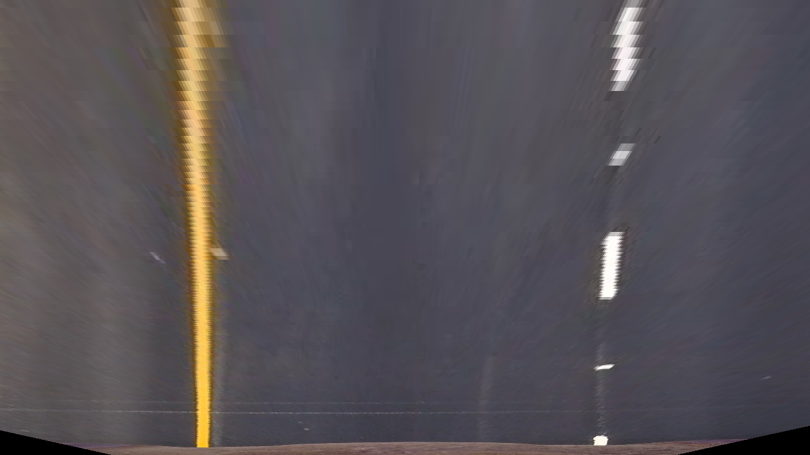

## Writeup 

---

**Advanced Lane Finding Project**

The goals / steps of this project are the following:

* Compute the camera calibration matrix and distortion coefficients given a set of chessboard images.
* Apply a distortion correction to raw images.
* Use color transforms, gradients, etc., to create a thresholded binary image.
* Apply a perspective transform to rectify binary image ("birds-eye view").
* Detect lane pixels and fit to find the lane boundary.
* Determine the curvature of the lane and vehicle position with respect to center.
* Warp the detected lane boundaries back onto the original image.
* Output visual display of the lane boundaries and numerical estimation of lane curvature and vehicle position.

[//]: # (Image References)

[image1]: ./examples/undistort_output.png "Undistorted"
[image2]: ./test_images/test1.jpg "Road Transformed"
[image3]: ./examples/binary_combo_example.jpg "Binary Example"
[image4]: ./examples/warped_straight_lines.jpg "Warp Example"
[image5]: ./examples/color_fit_lines.jpg "Fit Visual"
[image6]: ./examples/example_output.jpg "Output"
[video1]: ./project_video.mp4 "Video"

## [Rubric](https://review.udacity.com/#!/rubrics/571/view) Points

### Here I will consider the rubric points individually and describe how I addressed each point in my implementation.  

---

### Writeup / README

### Camera Calibration

#### 1. Briefly state how you computed the camera matrix and distortion coefficients. Provide an example of a distortion corrected calibration image.

The code for this step is contained in the 2nd code cell of the IPython notebook located in ".project2.ipynb".  

I proceeded the same way you suggested:

I start by preparing "object points", which will be the (x, y, z) coordinates of the chessboard corners in the world. Here I am assuming the chessboard is fixed on the (x, y) plane at z=0, such that the object points are the same for each calibration image.  Thus, `objp` is just a replicated array of coordinates, and `objpoints` will be appended with a copy of it every time I successfully detect all chessboard corners in a test image.  `imgpoints` will be appended with the (x, y) pixel position of each of the corners in the image plane with each successful chessboard detection.  

I then used the output `objpoints` and `imgpoints` to compute the camera calibration and distortion coefficients using the `cv2.calibrateCamera()` function.  I applied this distortion correction to the first calibration image (./camera_cal/calibration1.jpg) using the `cv2.undistort()` function and obtained this result: 
 

### Pipeline (single images)
I implemented the pipeline for all given test images. In the write-up I will provide the first test image as example of how the pipeline works while images of the final result/ steps inbetween of the other test images can be found in the ./output_images folder.

#### 1. Provide an example of a distortion-corrected image.

I implemented the distortion correction of the test images in the 3rd code cell using  `cv2.undistort()`. In the following, the first test image and the distortion correction of it are given.
 

#### 2. Describe how (and identify where in your code) you used color transforms, gradients or other methods to create a thresholded binary image.  Provide an example of a binary image result.

I used a combination of color and gradient thresholds to generate a binary image. The code for this is implemented in the 5th code cell while in the 4th code cell helper functions are defined. I combined the following binary images for the final image:

- `S = binary_channel(undistorted[i],(150,255))`: I filtered out all pixels with a S Value > 150
- `H = binary_channel(undistorted[i],(150,255), 'H')`: I filtered out all pixels with a H Value > 150
- `color = color_detection(undistorted[i],200)`: I filtered out all pixels with a R and G value bigger than 200. I left out the B value for the detection of yellow lines. The theshold 200 is chosen as high as possible without having the light gray parts of sunny streets are not detected.
- `gradient = binary_gradient(undistorted[i], (80,255))`: I filtered out all pixels with a gradient value >80. I used sobelx for that as it worked best for the detection of vertical lines.

Finally I combined the above mentioned binary images with an `OR` Operator. This is the output for test image 1:

 


#### 3. Describe how (and identify where in your code) you performed a perspective transform and provide an example of a transformed image.
I implemented the perspective transform as you suggested: 

The code for my perspective transform includes a function called `warper()`, which appears in the section Helper functions (4th code cell).  The `warper()` function takes as inputs an image (`img`), as well as source (`src`) and destination (`dst`) points.  I chose the hardcode the source and destination points in the following manner (Again, as you suggested):

```python
# source points for perspective transform
bottom_left = [585, 460]
bottom_right = [203, 720]
top_left = [1127, 720]
top_right = [695, 460]
source = np.float32([bottom_left,bottom_right,top_right,top_left])

# destination points for perspective transform
bottom_left = [320, 0]
bottom_right = [320, 720]
top_left = [960, 720]
top_right = [960, 0]
dest = np.float32([bottom_left,bottom_right,top_right,top_left])
```


I verified that my perspective transform was working as expected by drawing the `src` and `dst` points onto a test image and its warped counterpart to verify that the lines appear parallel in the warped image.
 
 


#### 4. Describe how (and identify where in your code) you identified lane-line pixels and fit their positions with a polynomial?

I used the window search to fit the line pixels with a polynomial. For this, I implemented two classes in code cell 7: 
- `LaneLines()`: A class with members for the right and left lane line which are objects from the class `Line()`. The method `detect_lines()` calls the repsective method for the line detection for the left and right lane line (see next bullet point) and detects if the lane computation makes sense (Sanity Check, further description in the video section.)
- `Lines()`: A class similar to the class you suggested for the project. This class mainly fits a polynomial to a given image and detected line pixels

My pipeline works in the following way:
- in code cell 6, I instantiated an object of the class `LaneLines()` and called the method `detect_lines()`:

```python

# Computation of the lane lines and visualization in the image
lines = LaneLines()
detected_lines, curvature, distance_center = lines.detect_lines(perspective)
```
- in the method `detect_lines()`, the following is executed:
    - As preparation for the window search, a histogramm of the bottom half of the picture detects the starting point for the window search. In contrast to the lecture, I did not use the complete bottom half of the image but only the inner part to not detect the lane lines which are further away.
    - the window search is executed for each line (right and left):The method `initiate_line()` is called for each line where the window search is executed analogous to the lecture: for each window, the good pixels inside the window are detected. Afterwards, all good pixels are fitted with a polynomial in the method `fit_polynomial`.
    - the curvature is computed for each line by calling the respective method `compute_curvature` and the distance from the car to the lane center is computed as explained in the lecture.
    - A sanity check is executed by calling the method `sanity_check`. This sanity check was intentionally implemented for the video and does not have an effect to the test images.
    - Finally, some drawing is executed for visualization purpose.

An example for the window search is given in the following image:
 

#### 5. Describe how (and identify where in your code) you calculated the radius of curvature of the lane and the position of the vehicle with respect to center.

I already explained in the previous section where I implemented this method because it is part of the same method `detect_lines()` as the previous part. 

I computed the radius of curvature in the following way: For the right and left line, I applied the formula for the radius of curvature given in the lecture and transformed it to the real world space using the same transformation parameters as in the lecture. Then, I averaged the results for the curvature of the lane.

The position of the vehicle with respect to the center is computed as described in the tips and tricks section of the project: The center between the two lane lines is computed and the distance to the vehicle center which is the center of the image is computed and transfered to the real world space. The sign of the distance detects if the vehicle is right or left of the center.
#### 6. Provide an example image of your result plotted back down onto the road such that the lane area is identified clearly.

I implemented the backtransformation in code cell 6 in the section "Backprojection to the original (undistorted) image. I used the same function `warper()` from code cell 4, but now with source and destination reversed. An image of my final result of test image 1 is given in the following:

 

---

### Pipeline (video)

#### 1. Provide a link to your final video output.  Your pipeline should perform reasonably well on the entire project video (wobbly lines are ok but no catastrophic failures that would cause the car to drive off the road!).

Here's a [link to my video result](./output_images/output_project_video.mp4)

I modified my pipeline in the following way:
- for the line detection, the method `initialize_line()` where the window search is executed is only in the first frame. Afterwards, the good pixels are detected in a horse around the polynomial from the previous frame (corresponding method: `update_line()`
- the sanity check detects implausible lane lines. Here, the width of the lane line is checked. If the lane line is implausible, the previous polynomial fit is used (method: `reject_update()`). Else, the polynomial fit is accepted (method: `accept_update()`)

---

### Discussion

#### 1. Briefly discuss any problems / issues you faced in your implementation of this project.  Where will your pipeline likely fail?  What could you do to make it more robust?

The biggest issue in this project for me was to generate the binary images in a way that the lane lines are detected completely but no further artefacts are detected falsely as lane lines (e.g. shadow lines, very light grey lanes,...). Finally, I adapted the parameters such that I got a good fit between detecting most of the lines but no other spurious artefacts. As this is not completely possible, I tried to balance these issues by the features mentioned in the section before. (Sanity check, including information from previous frames in the line detection)

Possible improvements would be to adapt the parameters for the binary image detection more carefully or to extend the sanity check, for example with identifying if the lanes are parallel. Additionally, a smoothing of the lane line over some frames in the video would be advantageous.

Finally, I hope to learn more about AI approaches, especially about deep learning in the further lectures to develop more robust approaches for the generation of the binary images.
